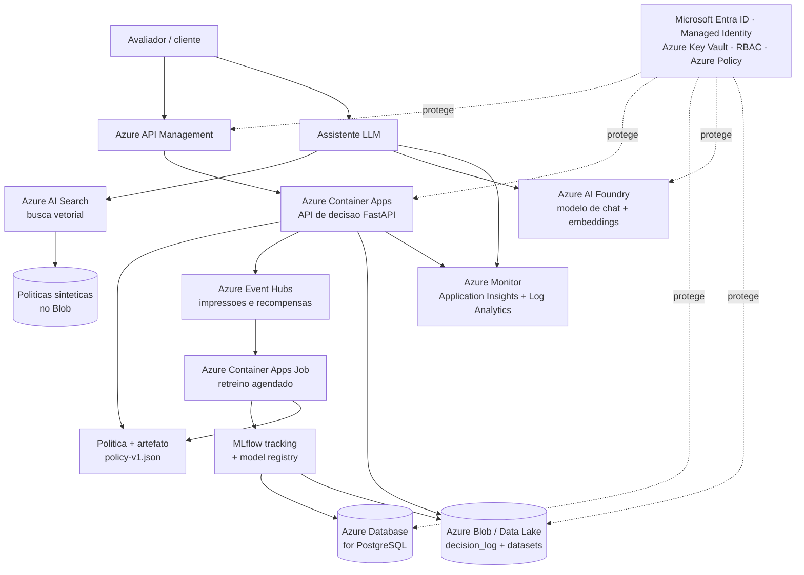

# Arquitetura-alvo Azure

Como a solução seria operada em produção, **exclusivamente em Microsoft Azure**.
Não há recursos provisionados; este é o desenho-alvo, com plano de deploy
(`infra/azure/deployment-plan.md`) e justificativa de cada escolha.

Princípio de design: **a arquitetura mais simples que cobre todas as camadas
exigidas** (compute, API, dados/eventos, IA/RAG, observabilidade, segurança,
identidade e governança), priorizando serviços gerenciados e custo baixo ocioso.

## Diagrama (Mermaid)

## Mapeamento por camada

| Camada | Nosso componente | Serviço Azure | Por quê (mais simples) |
|---|---|---|---|
| Compute | API de decisão + jobs | **Azure Container Apps** (+ ACR) | Roda nosso container FastAPI; escala a zero (barato ocioso); sem gerenciar Kubernetes |
| API/entrada | porta de entrada | **Azure API Management** | Autenticação, rate limit e versionamento da API num só ponto |
| Dados | datasets, artefatos, logs | **Azure Blob / Data Lake Storage Gen2** | Barato, durável; guarda Kaggle, processed, sintético, `policy-v*.json` e decision logs |
| Banco | tracking MLflow | **Azure Database for PostgreSQL** | Backend do MLflow (o store de arquivos foi descontinuado); um banco gerenciado simples |
| Eventos | impressões e recompensas atrasadas | **Azure Event Hubs** | Ingestão de eventos em fluxo; sustenta as delayed rewards |
| IA/RAG | assistente LLM | **Azure AI Foundry** (chat + embeddings) | Modelo gerenciado em Azure para explicar decisões |
| Busca | recuperação de políticas | **Azure AI Search** (vetorial) | Index dos documentos sintéticos para o RAG |
| MLOps | retreino e versionamento | **Container Apps Job + MLflow** | Job agendado/event-driven; MLflow registry para promover/reverter políticas |
| Observabilidade | métricas, logs, traces | **Azure Monitor + Application Insights + Log Analytics** | Latência, recompensa, drift, custo, uso do assistente |
| Identidade | quem acessa o quê | **Microsoft Entra ID + Managed Identity + RBAC** | Serviços se autenticam sem senha; acesso mínimo |
| Segredos | chaves e conexões | **Azure Key Vault** | Nenhum segredo no código ou na imagem |
| Governança | políticas da nuvem | **Azure Policy** | Impõe regras (ex.: só recursos permitidos, tags, criptografia) |

## Identidade e gestão de segredos

Regra: **nenhum segredo no código nem na imagem**. Tudo no Key Vault, acessado
por **Managed Identity** (a aplicação tem uma identidade própria no Entra ID e
pega os segredos sem usuário/senha).

| Segredo | Onde fica | Quem acessa |
|---|---|---|
| String de conexão do PostgreSQL | Key Vault | Container Apps (Managed Identity) |
| Chave do Azure AI Foundry / OpenAI | Key Vault | API e assistente |
| Chave do provedor LLM de dev (Anthropic) | Key Vault | só ambiente de dev |
| Acesso ao Blob/Data Lake | RBAC + Managed Identity | API e jobs (sem chave) |

O `.env.example` do repositório lista exatamente as variáveis que, em produção,
viram **secrets no Key Vault** (mapeamento 1:1). RBAC dá a cada serviço só o
acesso de que precisa (least privilege).

## Observabilidade

- **Application Insights**: latência e disponibilidade da API, erros.
- **Log Analytics**: consultas sobre os decision logs e traces.
- **Azure Monitor (alertas)**: dispara em drift de recompensa, latência alta ou
  custo acima do esperado.
- Métricas de negócio acompanhadas: conversão, regret, taxa de exploração,
  fairness de exposição e uso do assistente.

## Governança

- **Azure Policy**: só serviços/regions permitidos, criptografia obrigatória,
  tags de custo.
- **Humano no loop**: promoção de política exige aprovação (ver Etapa 7).
- **LGPD**: dados sintéticos, sem PII real; logs sem dado sensível (ver Etapa 8).

## Trade-offs (alternativas descartadas)

| Decisão | Escolhido | Descartado | Motivo |
|---|---|---|---|
| Compute | Container Apps | **AKS (Kubernetes)** | AKS é poderoso mas complexo e caro ocioso; não precisamos desse controle |
| Compute | Container Apps | **Azure Functions** | Nosso serviço é um container completo; Functions encaixa mal o FastAPI + estado |
| MLflow | self-hosted + PostgreSQL | **Azure Machine Learning** (MLflow gerenciado) | Azure ML é mais completo, porém mais pesado/caro para o escopo |
| Banco | PostgreSQL | **Cosmos DB** | Cosmos é ótimo para escala global, exagero aqui |
| LLM | Azure AI Foundry | provedor fora da Azure | Exigência: arquitetura só Azure (no dev usamos Claude; em produção o modelo é hospedado em Azure) |

## Escala e redução (maleabilidade)

| Volume | Comportamento |
|---|---|
| Baixa carga | Container Apps **escala a zero** (paga só pelo uso); Event Hubs em throughput mínimo |
| Alta carga | Container Apps adiciona réplicas automaticamente; Event Hubs aumenta throughput units; AI Search ganha réplicas |
| Ajuste manual | Tier do PostgreSQL e nº de réplicas do AI Search (não escalam sozinhos) |
| Custo mesmo ocioso | PostgreSQL e AI Search cobram parados; Container Apps e Blob quase não |

## Custo qualitativo (FinOps inicial)

| Serviço | Custo ocioso | Custo sob carga | Observação |
|---|---|---|---|
| Container Apps | ~zero (escala a zero) | baixo-médio | paga por requisição/CPU |
| Blob / Data Lake | muito baixo | baixo | barato por GB |
| PostgreSQL | baixo fixo | baixo | cobra mesmo parado (tier B) |
| Event Hubs | baixo | médio | por throughput unit |
| Azure AI Search | médio fixo | médio | **cobra mesmo ocioso** (tier mínimo) |
| Azure AI Foundry | zero | variável | paga por token (chamadas do assistente) |
| API Management | baixo-médio | médio | tier Consumption reduz ocioso |
| Monitor/Log Analytics | baixo | por GB ingerido | controlar volume de logs |

**ROI (raciocínio):** o ganho da política adaptativa sobre uma campanha estática
(mais conversão, menos tráfego desperdiçado) deve superar o custo incremental dos
serviços que cobram ociosos (principalmente AI Search e PostgreSQL). O
detalhamento de ROI e TCO entra no pitch (Etapa 8).
